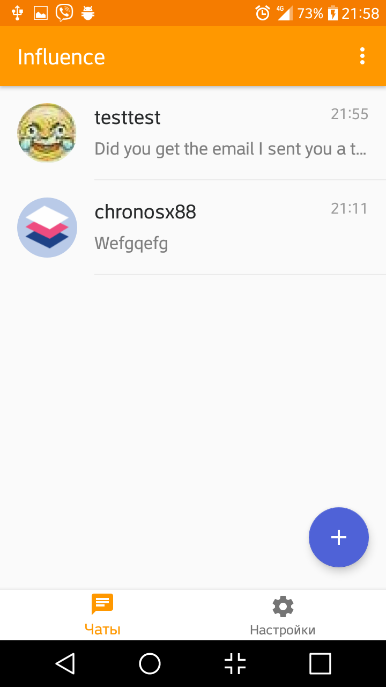
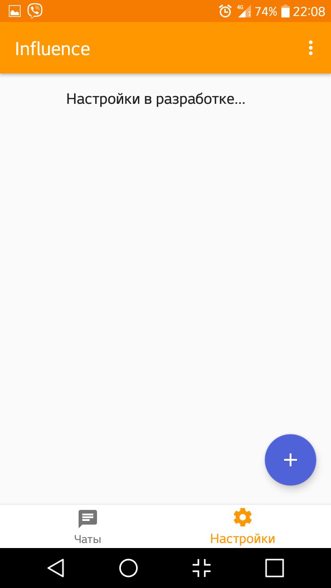
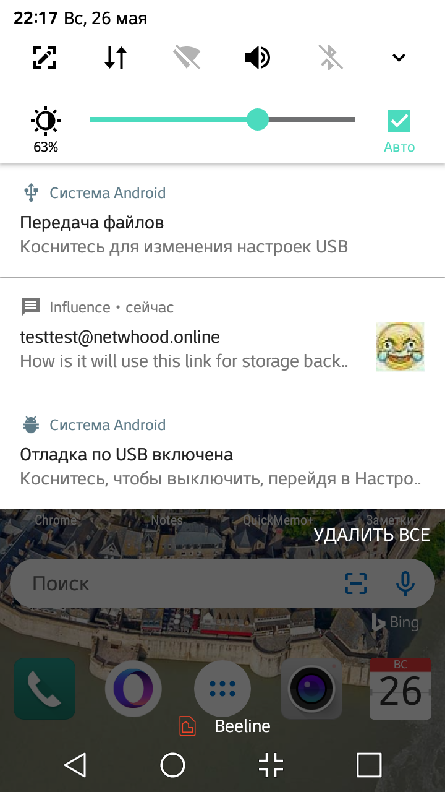

<p align="center">
	<h1 align="center">Influence</h1>
	<p align="center">
	<b>WARNING! This project is not maintained anymore!</b><br><br>
	<i>The free of influence</i> <br><br>
	<br>
	This is a simple, beautiful XMPP/Jabber client for Android.<br>
  </p>
 </p>

<!-- Used for the "back to top" links within the document -->
<div id="contents"></div>

## Table of Contents

- [Intro](#intro)
- [Screenshots](#screenshots)
- [Getting started](#getting-started)
- [Features](#features)
- [Useful links](#useful-links)
- [License](#license)
- [Author](#author)

## Intro
*[Soon]*

## Screenshots
   

## Getting started
1. Clone repo:
```bash
$ git clone https://github.com/ChronosX88/Influence.git
$ cd Influence
```
2. Simply open project in Android Studio.

(Also exists precompiled APKs - see Releases)

<sub>[⇧ back to top](#contents)</sub>

## Features
- 1:1 chats
- User presence
- Showing images in chat (currently unstable)
- Avatars
- Message history synchronization (MAM, XEP-313)
- Background service
- Notifications about new messages (currently unstable)
- Group chats *[coming soon]*
- Registration on XMPP servers *[coming soon]*
- Multi-account support *[coming soon]*
- Roster Managing *[coming soon]*
- OMEMO E2E Encryption *[coming soon]*
- Message Delivery Guarantee *[coming soon]*

<sub>[⇧ back to top](#contents)</sub>

## Useful links

- [Smack library GitHub](https://github.com/igniterealtime/Smack) - it is core library of this client.

<sub>[⇧ back to top](#contents)</sub>

## License

This project is licensed under the Apache License 2.0 - see the [LICENSE](LICENSE) file for details.

<sub>[⇧ back to top](#contents)</sub>

## Author

```txt
Author : ChronosX88
Email : chronosx88@gmail.com
Github : https://github.com/ChronosX88/Influence
```

[](https://forthebadge.com)

<sub>[⇧ back to top](#contents)</sub>
